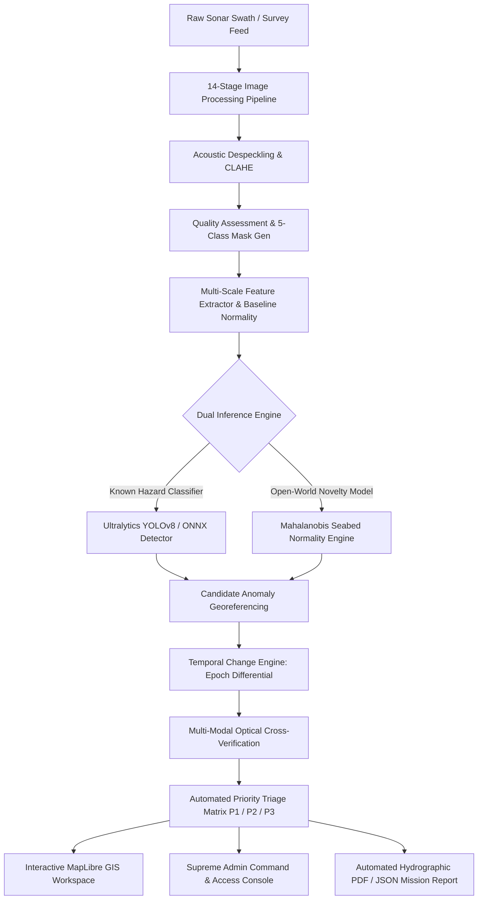

# 🌊 SIH26057: Ocean-X (S.A.G.A.R. Command)

<div align="center">


<br/>

### **Context-Aware Open-World Underwater Anomaly Intelligence & Seabed Survey Reconnaissance**
**Smart India Hackathon (SIH 2026) | Problem Statement ID: 26057**  
*Organization: **BPPIMTSIH26** | Lead Developer: **Narayan Kumar Jha (@narayan-nkj)***

</div>

---

## 📌 Problem Statement Overview (SIH 26057)

| Attribute | Specification Details |
| :--- | :--- |
| **Problem Statement ID** | **26057** |
| **Problem Statement Title** | **AI-assisted seabed survey analysis for faster anomaly detection & classification** |
| **Category** | Software / Maritime Defense / Hydrographic Intelligence |
| **Domain Bucket** | Smart Automation / Robotics & Autonomous Systems / Earth & Marine Sciences |
| **Target End-Users** | Hydrographic Surveyors, Naval Defense Units, Port Authorities, Offshore Energy Operators |
| **Core Innovation** | Zero-Shot Open-World Anomaly Detection + 14-Stage Acoustic Filtering + Multi-Modal Verification |

### The Real-World Challenge
Side-Scan Sonar (SSS) and Synthetic Aperture Sonar (SAS) surveys generate massive volumes of acoustic acoustic backscatter data during seabed mapping operations. Traditional survey analysis faces critical bottlenecks:
1. **Severe Acoustic Noise & Artifacts**: High speckle noise, non-uniform time-varied gain (TVG) attenuation, blind nadir gaps, and acoustic shadow occlusions.
2. **Open-World Anomaly Dilemma**: Standard detectors fail on novel or rare underwater objects (unexploded ordnance, severed submarine cables, novel wrecks) not present in rigid training datasets.
3. **Fatigue & Latency in Manual Review**: Human hydrographers take hours or days to manually scan gigabytes of waterfall acoustic imagery, delaying critical maritime safety decisions.
4. **Lack of Multi-Modal Confirmation**: Sonar alone cannot definitively confirm target identity without cross-referencing optical / camera sensor feeds from Autonomous Underwater Vehicles (AUVs).

---

## 💡 The S.A.G.A.R. Solution
**S.A.G.A.R.** (**S**onar **A**nomaly **G**eospatial **A**nalytical **R**econnaissance) is an end-to-end maritime intelligence command system designed to autonomously process, enhance, detect, cross-verify, and report seabed anomalies with sub-meter geospatial accuracy.



---

## 🌟 The Five Pillars of Intelligence

### 1. 🌐 Local Seabed Baseline Normality Engine
- Computes acoustic texture, roughness, and intensity statistics across local sliding windows.
- Calculates **Mahalanobis Distance** against the local geological baseline to answer: *"What is statistically abnormal for this specific seabed patch?"*
- Robust against variable seabed geologies (mud, sand ripples, rocky reefs, silt).

### 2. 🎯 Open-World Zero-Shot Anomaly Detection
- Powered by high-speed **ONNX Runtime** and **Ultralytics YOLOv8** for real-time edge or cloud deployment.
- Detects high-reflectance acoustic highlights paired with physical acoustic acoustic shadows to accurately estimate 3D target height and footprint.
- Classifies critical hazard categories:
  - **Shipwrecks** (Nordmeer, Grecian, Defiance, Monohansett, John J. Audubon)
  - **Ghost Fishing Nets & Marine Entanglements**
  - **Subsea Pipelines & Structural Leaks**
  - **Crab Pots & Submerged Navigation Hazards**
  - **Anthropogenic Marine Debris (Plastics & Heavy Metals)**

### 3. ⏱️ Temporal Change Intelligence (Survey Epoch Co-Registration)
- Aligns historical baseline passes against newly conducted survey swaths.
- Calculates pixel-level difference masks and spatial displacement vectors.
- Immediately isolates newly introduced hazards or shifting seabed debris fields between survey seasons.

### 4. 🔬 14-Stage High-Fidelity Image Processing & Quality Mask Pipeline
- **Adaptive Despeckling**: Median and bilateral filtering to eliminate reverberation speckle while preserving sharp acoustic shadow boundaries.
- **CLAHE (Contrast Limited Adaptive Histogram Equalization)**: Dynamic local contrast boosting across variable sonar illumination zones.
- **Robust Percentile Normalization**: Elimination of extreme sensor dropout and saturation spikes.
- **Automated QA Scoring**: Real-time evaluation of signal quality, speckle index, contrast rating, and swath coverage.
- **5-Class Diagnostic Quality Mask**: Generates color-coded spatial masks mapping:
  - 🟩 **Usable Seabed**
  - 🟨 **Uncertain / Low SNR**
  - 🟦 **Acoustic Shadow Regions**
  - 🟥 **Sensor Dropout / Saturated Pixels**
  - ⬛ **Nadir / Ignored Regions**

### 5. 🛡️ Military-Grade Access Control & Supreme Admin Console
- **Multi-Factor Gmail OTP Verification**: High-security email dispatch for operator authentication.
- **Auto-Lookup Personnel Registry**: Instant pre-filling of registered naval and hydrographic personnel details.
- **Supreme Admin Authorization Gateway**:
  - Restricts access until new accounts are explicitly approved by the Supreme Admin (`theghost4290@gmail.com`).
  - Real-time approval, role upgrade (Analyst, Operator, Supreme Admin), or instant revocation.

---

## 🖥️ System Architecture & UI Tour

<div align="center">

| Module | Route / Component | Description |
| :--- | :--- | :--- |
| **Tactical Dashboard** | `/` (`Dashboard.tsx`) | Real-time mission health, sensor telemetry, active alerts, and priority triage feed. |
| **Geospatial GIS Map** | `/map` (`MapWorkspace.tsx`) | Full MapLibre GL map with bathymetric layers, swath navigation tracks, and bounding boxes. |
| **14-Stage Processing Lab** | `/image-processing` (`ImageProcessing.tsx`) | Interactive side-by-side viewer for raw, enhanced, and 5-class QA diagnostic masks. |
| **Temporal Comparison** | `/temporal` (`TemporalComparison.tsx`) | Epoch-over-epoch differential analysis to detect seabed shifts and newly submerged targets. |
| **Survey Upload Portal** | `/upload` (`UploadProcess.tsx`) | Ingest raw SSS/SAS waterfalls, side-scan TIFFs, and AUV optical camera survey packages. |
| **Mission Review & Reports** | `/review` (`ReviewReport.tsx`) | Comprehensive hazard classification, confidence breakdowns, and exportable mission dossiers. |
| **Supreme Admin Console** | `/settings` (`Settings.tsx`) | Manage operator credentials, grant/revoke clearance, and inspect system audit logs. |

</div>

---

## 🛠️ Technology Stack

```
SIH26057-OceanX/
├── frontend/                # React 19 + TypeScript + Vite + MapLibre GL
│   ├── src/
│   │   ├── components/      # UI components, PriorityQueue, Glassmorphic widgets
│   │   ├── pages/           # 10 dedicated tactical & analysis pages
│   │   ├── contexts/        # AuthContext, NotificationContext
│   │   └── services/        # Axios API clients, WebSocket telemetry
└── backend/                 # FastAPI + PyTorch + ONNX Runtime + SQLite/SQLAlchemy
    ├── app/
    │   ├── api/             # REST API routers (Auth, Sonar, Detection, Processing)
    │   ├── ml/              # YOLOv8 & ONNX inference models
    │   ├── services/        # 14-stage image processor, OTP emailer, Report generator
    │   └── database/        # SQLAlchemy models, SQLite engine, Seeding logic
```

### Core Technologies
- **Frontend**: React 19, TypeScript, Vite 5, Tailwind CSS v4, MapLibre GL JS, Recharts, Lucide Icons.
- **Backend API**: Python 3.11+, FastAPI, Uvicorn, SQLAlchemy, Pydantic v2, SQLite.
- **Computer Vision & AI**: OpenCV (`cv2`), PyTorch, Ultralytics YOLOv8, ONNX Runtime, NumPy, SciPy, Pillow.
- **Geospatial Processing**: Shapely, PyProj, GeoPandas.
- **Security**: Argon2/PBKDF2 password hashing, JWT bearer tokens, SMTP Gmail OTP integration.
- **DevOps & Deployment**: Docker, Docker Compose, Shell Automation (`start.sh`, `stop.sh`, `run.py`).

---

## 🚀 Quick Start Guide

### Prerequisites
- **Node.js** (v18.0 or higher)
- **Python** (v3.10 or higher)
- **Git**
- *(Optional)* **Docker & Docker Compose**

---

### Option A: One-Command Startup (Recommended)

Run the unified orchestrator from the project root:

```bash
# Clone the repository
git clone https://github.com/BPPIMTSIH26/SIH26057.git
cd SIH26057

# Make scripts executable and start both servers
chmod +x start.sh stop.sh
./start.sh
```

*Or using Python:*
```bash
python3 run.py
```

- **Frontend Application**: `http://localhost:5173`
- **Backend Swagger API**: `http://localhost:8000/docs`
- **Interactive Backend Root**: `http://localhost:8000`

---

### Option B: Manual Setup

#### 1. Backend Service (FastAPI)
```bash
cd backend

# Create and activate virtual environment
python3 -m venv venv
source venv/bin/activate    # On Windows: venv\Scripts\activate

# Install dependencies
pip install -r requirements.txt

# Configure environment
cp .env.example .env

# Launch FastAPI server
uvicorn app.main:app --host 0.0.0.0 --port 8000 --reload
```

#### 2. Frontend Application (React + Vite)
```bash
cd frontend

# Install packages
npm install

# Launch Vite development server
npm run dev
```

---

### Option C: Docker Compose

```bash
docker-compose up --build
```

---

## 🔑 Default Credentials & Access Tiers

| Role | Email | Password | Access Rights |
| :--- | :--- | :--- | :--- |
| **Supreme Admin** | `theghost4290@gmail.com` | `Password123!` | Full System Governance, User Approval, Access Revocation, Mission Triage |
| **Senior Operator** | `admin@sonarnetra.mil` | `Password123!` | Mission Command, 14-Stage Processing, Model Execution, Report Export |
| **Field Analyst** | `analyst@sonarnetra.mil` | `Password123!` | Sonar Swath View, Anomaly Inspection, Optical Verification |

---

## 📡 REST API Reference

| Method | Endpoint | Description |
| :--- | :--- | :--- |
| `POST` | `/api/auth/login` | Authenticate operator and generate JWT token |
| `GET` | `/api/auth/lookup-operator` | Auto-lookup registered personnel by email |
| `POST` | `/api/auth/send-otp` | Dispatch 6-digit verification code to Gmail |
| `POST` | `/api/auth/verify-otp` | Validate submitted OTP code |
| `GET` | `/api/auth/users` | List all registered personnel *(Supreme Admin only)* |
| `PATCH` | `/api/auth/users/{id}/access` | Grant or revoke operator access clearance |
| `GET` | `/api/anomalies` | Retrieve all detected seabed anomalies with coordinates |
| `GET` | `/api/missions` | Query active and archived survey missions |
| `POST` | `/api/v1/image-processing/jobs` | Submit sonar image for 14-stage enhancement & QA masking |
| `GET` | `/api/v1/image-processing/jobs/{id}` | Inspect processing progress and download enhanced artifacts |
| `GET` | `/api/reports/generate/{id}` | Generate formal hydrographic anomaly dossier (PDF/JSON) |

---

## 👥 Hackathon Team & Acknowledgements

- **Organization**: **BPPIMTSIH26** (B.P. Poddar Institute of Management and Technology)
- **Smart India Hackathon 2026**: Problem Statement **26057**
- **Lead Developer & System Architect**: **Narayan Kumar Jha** ([@narayan-nkj](https://github.com/narayan-nkj))

---

<div align="center">
  <sub>Engineered with precision for Smart India Hackathon 2026. S.A.G.A.R. Command System.</sub>
</div>
