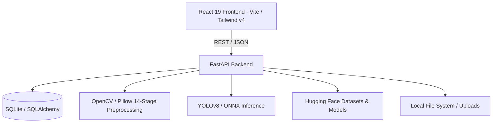

# NetraSonar (S.A.G.A.R.) Architecture

## High-Level Architecture
NetraSonar (S.A.G.A.R.) follows a decoupled client-server architecture designed for high-performance marine acoustic intelligence and seabed anomaly detection.

## System Components

### Frontend (`/frontend`)
- **Framework:** React 19 with Vite and TypeScript.
- **State Management:** React Context (`AppContext.tsx`, `AuthContext.tsx`).
- **Routing:** React Router DOM.
- **Geospatial Mapping:** MapLibre GL (`MapWorkspace.tsx`) for rendering geospatial anomalies with port boundary constraints.
- **UI Toolkit:** Tailwind CSS v4, Lucide React icons, and Recharts for analytical data visualization.

### Backend (`/backend`)
- **API Framework:** FastAPI with CORS and asynchronous request handling.
- **Route Controllers (`app/api/`):**
  - Authentication & RBAC (`routes_auth.py`)
  - Anomaly & Mission Management (`routes_anomalies.py`, `routes_detection.py`)
  - 14-Stage Image Preprocessing (`routes_processing.py`)
  - Report Generation (`routes_reports.py`)
  - File Uploads & Tile Handling (`routes_uploads.py`)
- **Core Services (`app/services/`):**
  - `image_processing_service.py`: 14-stage deterministic acoustic pipeline.
  - `ml_inference_service.py`: ONNX Runtime / YOLOv8 model loading and anomaly detection.
  - `auth_service.py`: JWT tokens, password hashing, and role verification.
- **Database (`app/database/`):** SQLAlchemy ORM models (`models.py`) and SQLite connection (`database.py`).

### Data & Model Storage
- **Database (`sonar_x.db`):** Stores Users, Anomalies, Missions, Detections, and Review status.
- **Local Storage (`data/uploads`):** Survey tiles, processed waterfall imagery, and bounding masks.
- **Model Weights & Hub:** Hugging Face Hub (`narayan-nkj/sagar-sonar-detector` & `narayan-nkj/sagar-sss`).
