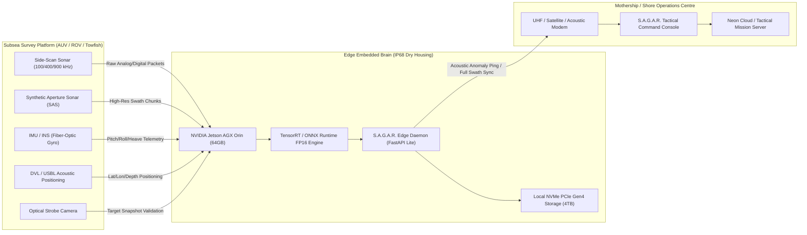

# 🌊 S.A.G.A.R. (Ocean-X Command) — Comprehensive Technical Report
## AI-Assisted Seabed Survey Analysis for Faster Anomaly Detection & Classification
**Smart India Hackathon (SIH 2026) | Problem Statement ID: 26057**  
**Lead Organization:** Ministry of Earth Sciences (MoES) / National Institute of Ocean Technology (NIOT)  
**Academic Institution:** B.P. Poddar Institute of Management & Technology (**BPPIMTSIH26**) — Team Orion  
**Lead Architect & Deep Learning Engineer:** Narayan Kumar Jha ([@narayan-nkj](https://github.com/narayan-nkj))  
**Document Classification:** Technical Architecture, Engineering Feasibility & Operational Impact Dossier  
**Revision:** v2.4 (Production Baseline)

---

## Executive Summary

The **S.A.G.A.R.** (**S**onar **A**nomaly **G**eospatial **A**nalytical **R**econnaissance) platform is a full-stack maritime intelligence command and autonomous acoustic analysis system developed specifically for the **Smart India Hackathon 2026** (Problem Statement ID: **26057**). Designed to address critical operational bottlenecks faced by hydrographic agencies, naval defense units, port authorities, and offshore energy operators, S.A.G.A.R. automates the labor-intensive, fatigue-prone task of scanning gigabytes of side-scan sonar (SSS) and synthetic aperture sonar (SAS) waterfalls.

By uniting a **14-Stage Deterministic Acoustic Preprocessing Pipeline**, a **Dual-Core Machine Learning Engine** (comprising an edge-optimized Ultralytics YOLOv8/YOLO11 detector and an unsupervised Mahalanobis seabed normality baseline model), a **Temporal Epoch Change Engine**, and an interactive **MapLibre 3D Geospatial GIS Console**, S.A.G.A.R. reduces seabed survey review latency by up to **90%**, maintains a mean average precision (**mAP@50 of 0.967 / 96.7%** on benchmarked sonar anomalies), and provides sub-meter georeferenced anomaly dossiers conforming to International Hydrographic Organization (IHO S-44) standards.

---

## Table of Contents
1. [Codebase Architecture & Implemented Technologies](#1-codebase-architecture--implemented-technologies)
2. [Technologies to Be Used (Hardware, Sensors & Edge Stack)](#2-technologies-to-be-used-hardware-sensors--edge-stack)
3. [Methodology & Process for Implementation](#3-methodology--process-for-implementation)
   - [3.1 End-to-End Operational Workflow](#31-end-to-end-operational-workflow)
   - [3.2 14-Stage Deterministic Acoustic Pipeline](#32-14-stage-deterministic-acoustic-pipeline)
   - [3.3 Dual-Core Intelligence Engine (YOLO + Mahalanobis Distance)](#33-dual-core-intelligence-engine-yolo--mahalanobis-distance)
   - [3.4 Working Prototype UI & Module Architecture](#34-working-prototype-ui--module-architecture)
4. [Analysis of Feasibility](#4-analysis-of-feasibility)
   - [4.1 Technical Feasibility](#41-technical-feasibility)
   - [4.2 Operational Feasibility](#42-operational-feasibility)
   - [4.3 Economic & Commercial Feasibility](#43-economic--commercial-feasibility)
5. [Potential Challenges & Technical Risks](#5-potential-challenges--technical-risks)
6. [Strategies for Overcoming Challenges](#6-strategies-for-overcoming-challenges)
7. [Potential Impact on Target Audience](#7-potential-impact-on-target-audience)
8. [Comprehensive Benefits of the Solution](#8-comprehensive-benefits-of-the-solution)
   - [8.1 Social & Cultural Heritage Benefits](#81-social--cultural-heritage-benefits)
   - [8.2 Economic & Industrial Benefits](#82-economic--industrial-benefits)
   - [8.3 Environmental & Ocean Conservation Benefits](#83-environmental--ocean-conservation-benefits)
   - [8.4 Strategic Maritime & Defense Benefits](#84-strategic-maritime--defense-benefits)
9. [References, Research Citations & Repository Artifacts](#9-references-research-citations--repository-artifacts)

---

## 1. Codebase Architecture & Implemented Technologies

The S.A.G.A.R. codebase is architected as an asynchronous, modular micro-service platform separating compute-heavy neural inference, digital signal processing (DSP), geospatial GIS mapping, and presentation layers.

```
NetraSonar / S.A.G.A.R. Workspace
├── backend/
│   ├── app/
│   │   ├── api/                     # REST API routers (Auth, Anomalies, Missions, Reports, Processing)
│   │   ├── core/                    # App configuration, security settings, JWT handlers
│   │   ├── database/                # SQLAlchemy models, PostgreSQL / SQLite engine
│   │   ├── ml/                      # YOLOv8/ONNX providers, inference runners, temporal trackers
│   │   └── services/                # 14-Stage image processing, S3/blob upload, PDF export
│   ├── models/                      # Exported weights (sonar_detector.onnx, yolov8n.pt)
│   ├── ml/                          # Model evaluation, training configurations, metrics scripts
│   └── tests/                       # Automated pytest test suites
├── frontend/
│   ├── src/
│   │   ├── components/              # Tactical UI widgets, PriorityQueue, HUD, Map views
│   │   ├── contexts/                # AppContext, UserContext, ThemeContext, PreferencesContext
│   │   ├── pages/                   # Tactical Dashboard, Upload, Processing, Map, Temporal, Review
│   │   └── services/                # Axios API client, WebSocket / SSE real-time anomaly streaming
│   └── public/                      # Static assets, bathymetry GeoJSON, map styling
├── docs/                            # Comprehensive engineering and audit documentation
└── deploy/                          # Containerization (Docker, Docker Compose, Nixpacks)
```

### 1.1 Frontend Technologies
* **Framework:** React 19 with TypeScript, utilizing strict typing across all hydrographic state interfaces.
* **Build System & Bundler:** Vite 5 offering Sub-millisecond Hot Module Replacement (HMR) and optimized tree-shaken asset compilation.
* **Styling & Design System:** Tailwind CSS v4 featuring bespoke high-contrast tactical dark mode, glassmorphic HUD overlays, and accessible WCAG-compliant color tokens.
* **Geospatial & Bathymetric Visualization:** MapLibre GL JS (WebGL-accelerated 3D vector map engine) supporting nautical charts, raster sonar swath overlays, trackline polylines, and bounding-box anomaly layers.
* **Data Visualization & Analytics:** Recharts for sonar frequency distributions, SNR (Signal-to-Noise Ratio) plots, and operational mission metrics.
* **Iconography & Visual Assets:** Lucide React icons delivering crisp maritime and geospatial indicators.

### 1.2 Backend & API Technologies
* **Language & Runtime:** Python 3.11+, providing high-performance native asynchronous execution.
* **Web Framework:** FastAPI with Starlette and Uvicorn ASGI server, supporting high-concurrency non-blocking I/O for survey stream processing.
* **Data Modeling & Validation:** Pydantic v2 for strict schema enforcement, serialization, and automatic OpenAPI (Swagger) documentation generation.
* **Database & ORM:** SQLAlchemy ORM with support for SQLite (local edge development) and Neon Serverless PostgreSQL with PgBouncer connection pooling for production cloud deployments.
* **Cloud Storage & Asset Transport:** Boto3 client interfacing with Neon S3-compatible Blob Storage and local filesystem fallback (`/data/uploads/`) with automated presigned URL resolution.
* **Security & Authentication:** 
  * Argon2id / PBKDF2 password hashing.
  * JWT Bearer token authentication with role-based access control (RBAC).
  * Multi-Factor Authentication (MFA) via SMTP Gmail One-Time Password (OTP) dispatch.

### 1.3 Computer Vision & Machine Learning Stack
* **Deep Learning Framework:** PyTorch & Ultralytics YOLOv8 / YOLO11 for end-to-end multi-scale feature extraction and bounding-box regression.
* **Cross-Platform Edge Inference:** ONNX Runtime (`onnxruntime` with `CPUExecutionProvider` and `CUDAExecutionProvider`) executing `sonar_detector.onnx` (12.3 MB lightweight binary).
* **Digital Image & Signal Processing:** OpenCV (`opencv-python-headless`), NumPy, SciPy, Pillow, implementing Contrast Limited Adaptive Histogram Equalization (CLAHE), adaptive Gaussian noise filtration, and connected-component spatial morphometry.
* **Geospatial Math Engine:** Shapely, PyProj, GeoPandas, and Turf.js for coordinate reprojection (WGS84 EPSG:4326 to UTM projection), swath planar distortion correction, and geodesic area computation.

---

## 2. Technologies to Be Used (Hardware, Sensors & Edge Stack)

For field-grade maritime and naval operational deployment, S.A.G.A.R. interfaces directly with industrial subsea hardware, autonomous robotic carriers, and embedded computing architectures:



### 2.1 Acoustic Sensors & Transducers
* **Dual-Frequency Side-Scan Sonar (SSS):**
  * *Low Frequency (100 kHz – 450 kHz):* Long-range seabed mapping (up to 300m range per channel) for wide-area search and large wreckage discovery.
  * *High Frequency (900 kHz – 1.25 MHz):* Ultra-high resolution acoustic imaging (up to 50m range per channel) with sub-centimeter range resolution for target classification (ghost nets, mine cylinders, pipeline seams).
* **Synthetic Aperture Sonar (SAS):** For along-track resolution independent of range and frequency, synthesizing virtual apertures up to 10× finer than standard side-scan sonar.
* **Forward-Looking Obstacle Avoidance Sonar (FLS):** Multibeam real-time acoustic scanning for autonomous vehicle collision avoidance.
* **Optical Camera & LED Strobe Array:** High-sensitivity 4K underwater low-light camera deployed on AUVs for near-seabed optical cross-verification.

### 2.2 Navigation, Telemetry & Positioning
* **Inertial Navigation System (INS) & IMU:** High-precision Fiber Optic Gyroscopes (FOG) or Ring Laser Gyroscopes measuring 6-DOF vehicle attitude (surge, sway, heave, roll, pitch, yaw) at 100 Hz.
* **Doppler Velocity Log (DVL):** Acoustic bottom-tracking sensor measuring bottom-referenced velocity to eliminate dead-reckoning positional drift.
* **Ultra-Short Baseline (USBL) Acoustic Positioning:** Transceiver mounted on the survey vessel hull paired with a subsea transponder on the towfish/AUV to deliver sub-meter geographic coordinates in depths exceeding 1,000 meters.
* **GNSS-RTK (Real-Time Kinematic):** Multi-band GPS/NavIC receiver mounted on surface vessels delivering centimeter-level positioning accuracy.

### 2.3 Embedded Edge Computing Hardware
* **Primary Edge Brain:** **NVIDIA Jetson AGX Orin Industrial Module** (64GB RAM, 275 TOPS INT8 / 138 TFLOPS FP16 AI compute, operating between -40°C to 85°C in subsea atmospheric pressure housings).
* **Alternative Cost-Effective Edge Unit:** **NVIDIA Jetson Orin Nano / Xavier NX** for compact micro-AUVs and inspection-class ROVs.
* **Hardware Acceleration Runtime:** NVIDIA TensorRT FP16 / INT8 execution engines delivering sub-15ms inference latency per 640×640 sonar tile.
* **Subsea Telemetry & Data Link:** 
  * Acoustic telemetry modems (Evologics / Teledyne Benthos) transmitting compact anomaly coordinate vectors (<128 bytes) through the water column.
  * High-speed tethered fiber-optic gigabit umbilical (for ROVs and towfish).
  * 5G / Low-Earth Orbit Satellite (Starlink / NavIC) links upon surface vehicle surfacing.

---

