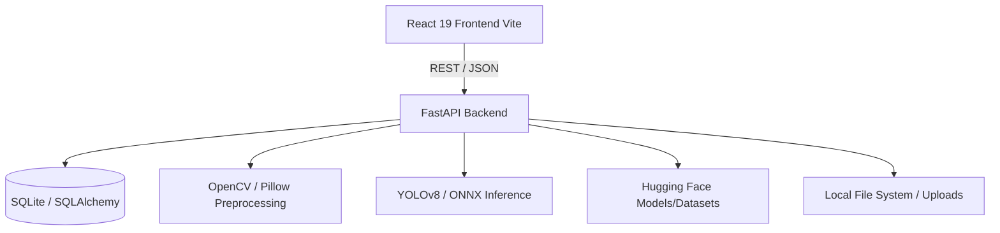

# S.A.G.A.R. Architecture Map

## High-Level Architecture
S.A.G.A.R. follows a decoupled client-server architecture.

## Frontend Components
- **State Management:** React Context (`AppContext.tsx`, `AuthContext.tsx`).
- **Routing:** React Router DOM.
- **Mapping:** MapLibre GL (`MapWorkspace.tsx`) for rendering geospatial anomalies on specific port bounds.
- **UI Toolkit:** Tailwind CSS v4, Lucide React icons, Recharts for data visualization.

## Backend Modules
- **`app/main.py`**: FastAPI entry point, CORS configuration.
- **`app/api/`**: Route controllers (Auth, Anomalies, Processing, Uploads).
- **`app/services/`**: Core business logic.
  - `image_processing_service.py`: Pipeline orchestration (14-stages).
  - `ml_inference_service.py`: ONNX/YOLO model loading and prediction.
  - `auth_service.py`: JWT, hashing, OTP.
- **`app/database/`**: SQLAlchemy models (`models.py`) and connection (`database.py`).
- **`auditing/`**: Security and verification logs.

## Data Persistence
- **SQLite Database (`sonar_x.db`)**: Stores Users, Anomalies, Missions, Audits.
- **Local Storage (`data/uploads`)**: Stores uploaded survey tiles and generated masks.
- **Hugging Face (`narayan-nkj/sagar-sss`)**: External repository for datasets and model weights (downloaded on demand).
